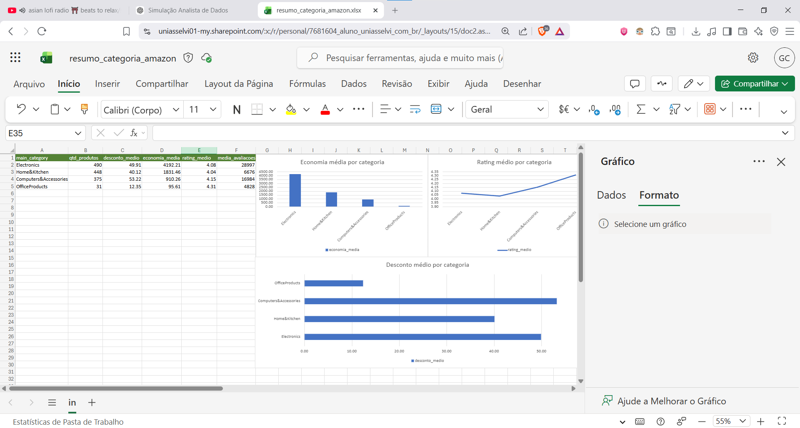

# Análise de Produtos da Amazon

Este projeto é uma análise exploratória de uma base de produtos da Amazon utilizando Python e Pandas.

## Objetivo

O objetivo foi simular uma rotina de analista de dados, realizando limpeza, tratamento e análise dos dados para identificar padrões de preço, desconto, avaliação e categorias de produtos.

## Etapas realizadas

- Importação do arquivo CSV
- Verificação de linhas, colunas e tipos de dados
- Tratamento de colunas numéricas como preço, desconto, rating e quantidade de avaliações
- Criação da coluna `discount_value`, representando a economia em valor absoluto
- Remoção de produtos repetidos com base no `product_id`
- Criação da coluna `main_category`, separando a categoria principal
- Análise de desconto médio, economia média, rating médio e quantidade de produtos por categoria
- Criação de gráficos simples com Matplotlib
- Exportação de bases tratadas em CSV

## Principais insights

- A categoria `Computers&Accessories` apresentou o maior desconto médio percentual entre as categorias com volume relevante.
- A categoria `Electronics` apresentou a maior economia média em valor absoluto, indicando produtos de maior ticket.
- As categorias com maior volume de produtos foram `Electronics`, `Home&Kitchen` e `Computers&Accessories`.
- O rating médio das principais categorias ficou próximo de 4.0, indicando avaliações geralmente positivas.

## Dashboard em Excel

## Tecnologias utilizadas

- Python
- Pandas
- Matplotlib
- Jupyter Notebook
